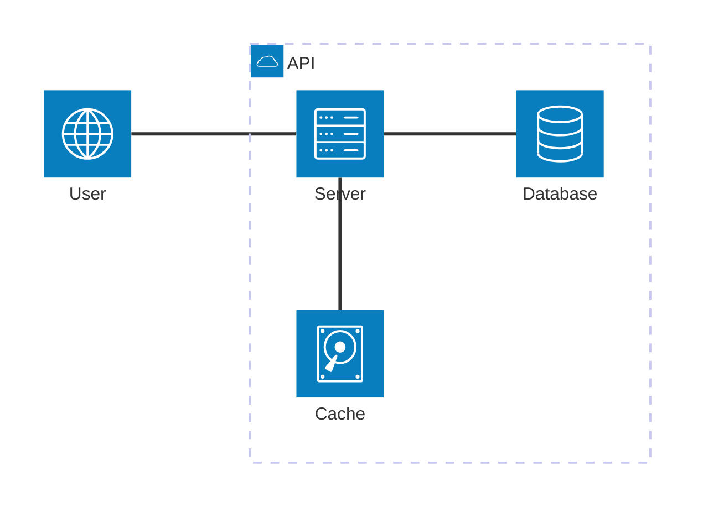

# URL Shortener Challenge

## Description

A URL Shortener is a service that takes a long URL and generates a shorter, unique alias that redirects users to the original URL. This alias is often a fixed-length string of characters. The system should be able to handle millions of URLs, allowing users to create, store, and retrieve shortened URLs efficiently. Each shortened URL needs to be unique and persistent. Additionally, the service should be able to handle high traffic, with shortened URLs redirecting to the original links in near real-time. In some cases, the service may include analytics to track link usage, such as click counts and user locations.

## Requirement Analysis

### Functional Requirements

- URL Shortening: Users should be able to input a long URL and receive a unique, shortened alias. The shortened URL should use a compact format with English letters and digits to save space and ensure uniqueness;
- URL Redirection: When users access a shortened URL, the service should redirect them seamlessly to the original URL with minimal delay;
- Link Analytics: The system should be able to track the number of times each shortened URL is accessed to provide insights into link usage.

### Non-Functional Requirements

- Simplicity: Focus on a simple design.
- Latency: Minimize redirect latency.
- Performance: Should perform reasonably well even though it’s not required to handle production-scale traffic.
- Language: You may use Python, JavaScript/TypeScript, Go, or C/C++.
- Protocol limitations:
  - Limit implementation to HTTP/1.1.
  - No TLS handling is needed.
- Logging format: Output must be structured and machine-consumable (e.g., JSON).

### Scale Requirements

- 100M Daily Active Users
- Read:write ratio = 100: 1
- Data retention for 5 years
- Assuming 1 million write requests per day
- Assuming each entry is about 500 bytes

## How to run this project

To execute this project, first copy the `.env.example` file and rename it to `.env`:

```sh
$ cp .env.example .env
```

Then, if you have docker installed on your machine, build the application containers with:

```sh
$ docker compose up
```

**P.S.**: If necessary, use the --build flag to enforce docker compose to rebuild the image

Finally, access the application by opening the following URL in your browser:

```
http://localhost:3000
```

## Solution Details

### Architecture



### Url Shortening

For a readable shortened URL we can opt to use only numbers and common characters. Using this approach we would have 26 characters from a-z, and 10 numbers from 0-9. If we mix the 26 characters with its uppercase and lowercase variants, we will have:

$$
10 + 2 \cdot 26 = 62 \text{, possible symbols to represent the encoded url}
$$

With the data retention condition of 5 years in mind, and knowing that at each day we have 1M write request per day, we have that:

$$
5_{\text{year}} \cdot 365_{\text{days/year}} \cdot (1 \cdot 10^{6})_{\text{writes/day}} = 1.825 \cdot 10^{9}_{\text{writes}}
$$

So in order to fulfill those requirements, we would need a minimum of:

$$
62^{n} \geq 1.825 \cdot 10^{9} \text{, where } n \text{ is an integer }
$$

$$
62^{6} \approx 56.8 \cdot 10^{9}
$$

With $n = 6$, and with the assumptions mentioned earlier, the chance of collision for a new URI after 5 years would be of:

$$
1 - \frac{56.8 - 1.825}{56.8} \approx 3.3 \%
$$

## TO-DO

- [] URL Shortening: Create an endpoint that allows and stores a shortened URL;
- [] URL Redirection: Create an endpoint that redirects a user given a shortened URL;
- [] Link Analytics.

## References

- [System Design School - Design URL Shortener](https://systemdesignschool.io/problems/url-shortener/solution);
- [MarkDown Mermaid Diagram - MermaidJS](https://mermaid.js.org/syntax/architecture.html);