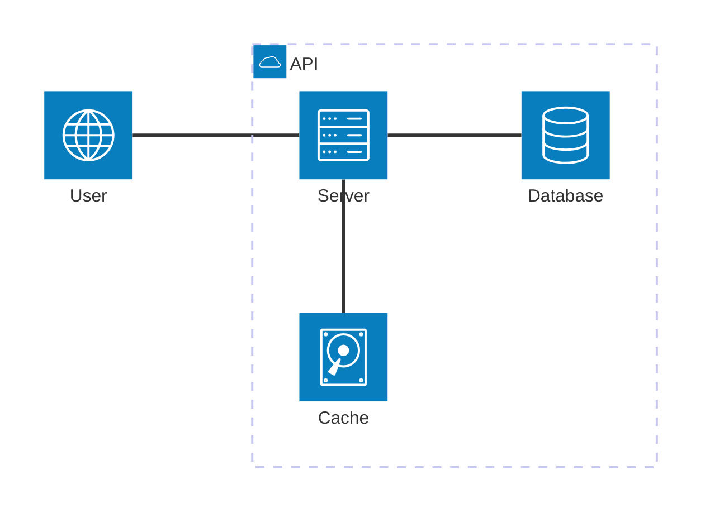

# URL Shortener Challenge

## Description

A URL Shortener is a service that takes a long URL and generates a shorter, unique alias that redirects users to the original URL. This alias is often a fixed-length string of characters. The system should be able to handle millions of URLs, allowing users to create, store, and retrieve shortened URLs efficiently. Each shortened URL needs to be unique and persistent. Additionally, the service should be able to handle high traffic, with shortened URLs redirecting to the original links in near real-time. In some cases, the service may include analytics to track link usage, such as click counts and user locations.

## Requirement Analysis

### Functional Requirements

- URL Shortening: Users should be able to input a long URL and receive a unique, shortened alias. The shortened URL should use a compact format with English letters and digits to save space and ensure uniqueness;
- URL Redirection: When users access a shortened URL, the service should redirect them seamlessly to the original URL with minimal delay;
- Link Analytics: The system should be able to track the number of times each shortened URL is accessed to provide insights into link usage.

### Non-Functional Requirements

- Simplicity: Focus on a simple design.
- Latency: Minimize redirect latency.
- Performance: Should perform reasonably well even though it’s not required to handle production-scale traffic.
- Language: You may use Python, JavaScript/TypeScript, Go, or C/C++.
- Protocol limitations:
  - Limit implementation to HTTP/1.1.
  - No TLS handling is needed.
- Logging format: Output must be structured and machine-consumable (e.g., JSON).

### Scale Requirements

- 100M Daily Active Users
- Read:write ratio = 100: 1
- Data retention for 5 years
- Assuming 1 million write requests per day
- Assuming each entry is about 500 bytes

## How to run this project

To execute this project, first copy the `.env.example` file and rename it to `.env`:

```sh
$ cp .env.example .env
```

This application uses mongodb replica set structure for handling transactions. Due to this we will need to a few commands before starting the application:

```sh
$ mkdir -p ./apps/backend/.volumes/mongodb
```

```sh
$ touch ./apps/backend/.volumes/mongodb/mongodb.conf
```

And paste the following configs into the config file:

```yaml
replication:
  replSetName: rs0

security:
  authorization: enabled
  keyFile: /etc/mongodb-keyfile

net:
  bindIpAll: true
  port: 27017
  unixDomainSocket:
    enabled: false

storage:
  dbPath: /data/db
```

Then we will need to generate an authorization key-file for the replica set. We can do this by running the command bellow:

```sh
$ openssl rand -base64 756 > ./apps/backend/.volumes/mongodb/mongodb-keyfile
```

The keyfile should only have read-only permissions, so in order to enforce this, we can run:

```sh
$ chmod 400 ./apps/backend/.volumes/mongodb/mongodb-keyfile
```

And to guarantee that the keyfile is accessible by the container user, we should execute the following command:

```sh
$ sudo chown 999:999 ./apps/backend/.volumes/mongodb/mongodb-keyfile
```

Then, if you have docker installed on your machine, build the application containers with:

```sh
$ docker compose up
```

**P.S.**: If necessary, use the --build flag to enforce docker compose to rebuild the image

We now need to manually initialize the replica set using:

```sh
$ docker exec -it url-shortener-database sh
```

```sh
$ mongosh -u ${MONGO_INITDB_ROOT_USERNAME} -p ${MONGO_INITDB_ROOT_PASSWORD}
```

```sh
$ rs.initiate()
```

Finally, access the application by opening the following URL in your browser:

```
http://localhost:3000
```

## How to run the stress tests

In order to test this application and measure its performance in real world scenarios, we decided to use [Grafana K6](https://grafana.com/docs/k6/latest/). k6 is an open-source, developer-friendly, and extensible load testing tool, that prevents performance issues and proactively improve reliability.

To execute the stress tests, first start the application with the command bellow:
```sh
$ docker compose --profile stress-test up --build
```

Then, to generate the test reports, execute the following:
```sh
$ docker exec url-shortener-stress-test-application k6 run index.js
```

This command will execute the test script available at the `backend-e2e` package using the k6 instance, and log its results into the terminal. For exporting the reports in HTML format, execute the command bellow:
```sh
$ mkdir -p ./.reports && docker cp url-shortener-stress-test-application:/app/apps/backend-e2e/reports/stress-test-report.html ./.reports/stress-test-report.html
```

**P.S.**: Consider reading the [Grafana k6 metrics reference page](https://grafana.com/docs/k6/latest/using-k6/metrics/reference/) for more details about the metrics and how they should be interpreted.

## Solution Details

### Architecture



### Url Shortening

For a readable shortened URL we can opt to use only numbers and common characters. Using this approach we would have 26 characters from a-z, and 10 numbers from 0-9. If we mix the 26 characters with its uppercase and lowercase variants, we will have:

$$
10 + 2 \cdot 26 = 62 \text{, possible symbols to represent the encoded url}
$$

With the data retention condition of 5 years in mind, and knowing that at each day we have 1M write request per day, we have that:

$$
5_{\text{year}} \cdot 365_{\text{days/year}} \cdot (1 \cdot 10^{6})_{\text{writes/day}} = 1.825 \cdot 10^{9}_{\text{writes}}
$$

So in order to fulfill those requirements, we would need a minimum of:

$$
62^{n} \geq 1.825 \cdot 10^{9} \text{, where } n \text{ is an integer }
$$

$$
62^{6} \approx 56.8 \cdot 10^{9}
$$

With $n = 6$, and with the assumptions mentioned earlier, the chance of collision for a new URI after 5 years would be of:

$$
1 - \frac{56.8 - 1.825}{56.8} \approx 3.3 \%
$$

### Storing the URLs

Considering the load of 1M writes per day and the number of 100M accesses, it is reasonable to expect the need for splitting our database into shards. Due to the simplicity of the data necessary to run this application using a NoSQL database might be a more straight trough solution.

Due to the reasons previously presented, we will be using MongoDB for this application. With that in mind we can now design how we are going to present the URLs. A good option would be use auto incremented values encoded in base 62 and prefixed with identifiers that could allow us to know before hand in which database shard they are stored.

## Searching for an Encoded URL

## Caching


## TO-DO

- [X] URL Shortening: Create an endpoint that stores a shortened URL;
- [X] URL Redirection: Create an endpoint that redirects a user given a shortened URL;
- [ ] Link Analytics.

## References

- [System Design School - Design URL Shortener](https://systemdesignschool.io/problems/url-shortener/solution);
- [MarkDown Mermaid Diagram - MermaidJS](https://mermaid.js.org/syntax/architecture.html);
- [Grafana K6](https://grafana.com/docs/k6/latest);
- [Docker Health Checks](https://last9.io/blog/docker-compose-health-checks/);
